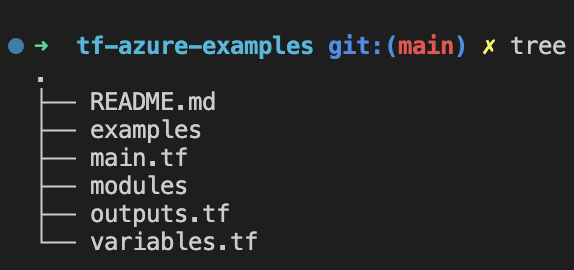

# Terraform

## Standard module structure


The standard module structure is Terraform recommended flat file and directory structure for reusable modules distributed in separate repositories (i.e. Git, S3 bucket, HTTP storage url etc).

### Root module

Root module is the only required element for a standard module structure. Terraform toolchain expects files belonging to the Root module exist in the root directory of the repository.

Hence if you are developing a sub module that is shared for multiple repositories within the KPMG migration solution then please provide a special ``double-slash (//)`` syntax for indicating that the remaining path after that point is a sub-directory within the repository you are referencing.

For an example; 

If you are referencing a ``root module`` hosted in the Github for ``kpmg-uk`` organisation in the ``keyvault`` repository;

```terraform
    module "example" {
        source = "github.com/kpmg-uk/keyvault"
    }
```

If you are referencing a ``sub module`` (i.e network) hosted in the Github for ``kpmg-uk`` organisation in the ``tf-azure-templates`` repository;

```terraform
    module "example" {
        source = "github.com/kpmg-uk/tf-azure-templates//modules/network?ref=v0.0.1"
    }
```


Below is an example minimal module structure.



## Documentation

We are using [terraform-docs](https://terraform-docs.io/) to generate documentation for your infrastructure code.
Please [click here](https://terraform-docs.io/user-guide/installation/) for the installation instructions for your platform.

Then, run below command from the root directory to generate documentation:

```
terraform-docs markdown table . > docs/terraform-docs.md 
```

This is an [example](terraform-docs.md) documentation generated for this project.
